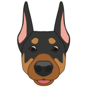

<h1 align="center">Hi 👋, I'm Ferid</h1>
<h3 align="center">Full Stack Developer</h3>

- :computer: I’m currently working on **ABC-Telecom**

- 👨‍💻 I’m currently learning **ReactJs,NodeJs**

- :mortar_board: I’m study **<a href="https://www.aztu.edu.az/az#/azp/main.do">AZTU</a>**

- :e-mail: How to reach me **feridqarayev11@gmail.com**

-  I love **my dog :heart:**
- 

      
       I look a lot like the <b>linguine</b> from the cartoon ratatouille
  

<h3 align="left">Connect with me:</h3>

    

<h3 align="center">Languages and Tools:</h3>

    <!--  -->
    

    
    
    
    
    
    
    
    
    
    
    
    
    
    
    
    

    

    
    
    
    
    
     
    

 

    

